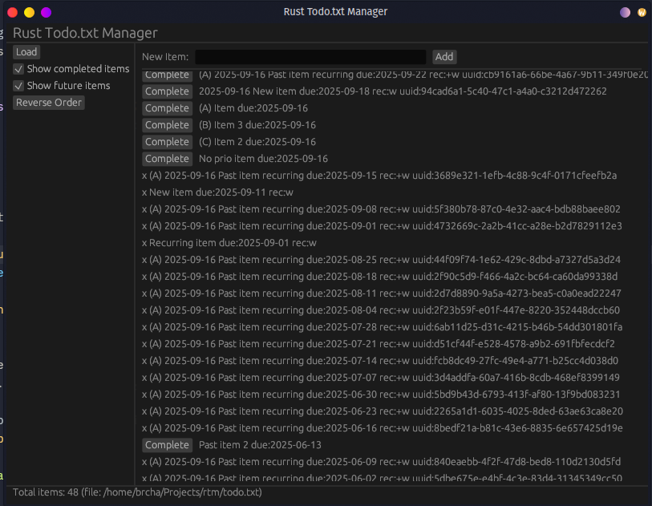

# Rusty Todo Manager

This is a [Todo.txt](https://github.com/todotxt/todo.txt) managment app, written in Rust. Very early development, but a few things already work.

Here's a screenshot:

# License

[MIT](https://brcha.mit-license.org/@2023)
