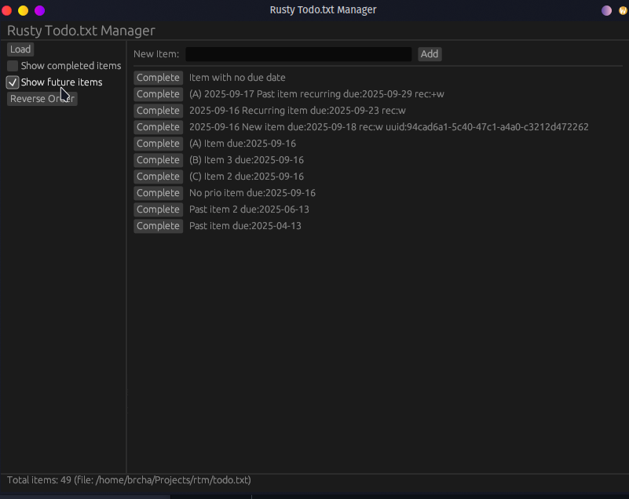
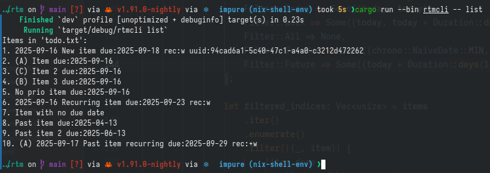

# Rusty Todo Manager

This is a [Todo.txt](https://github.com/todotxt/todo.txt) managment app, written in Rust. Very early development, but a few things already work.

Here's a screenshot of the GUI:

and of the CLI:

## General plan

- [ ] Implement basic functionality of the Todo.txt manager with CLI and desktop GUI (for GNU/Linux, Mac OS X and Windows, since I use all of those).
- [ ] Create cloud synchronisation for the Todo.txt files (ideas welcome, my plan is to setup a private git repo, which is what I currently use anyway)
- [ ] Make a mobile GUI for the library (Android centric, but hopefully cross platform).
- [ ] Add subtasks as a concept (already provided uuid and sub tags for todo.txt items, needs implementation in cli/ui)
- [ ] Add comments for items (using uuid and some comment storage, probably specific subdir of the todotxt git-managed directory)

## License

[MIT](https://brcha.mit-license.org/@2023)
