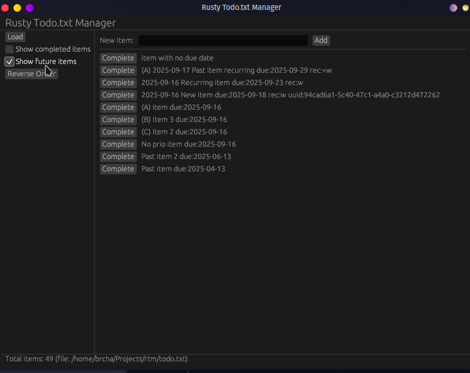
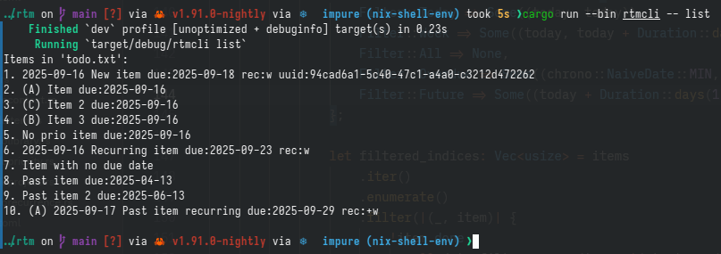

# Rusty Todo Manager

This is a [Todo.txt](https://github.com/todotxt/todo.txt) managment app, written in Rust. Very early development, but a few things already work.

Here's a screenshot of the GUI:

and of the CLI:

## Installing

### Windows (x64)

Grab the latest release from [GitHub Releases](https://github.com/brcha/rtm/releases):

- **`rtmapp_<version>_x64_en-US.msi`** — installer for the desktop GUI. Requires administrator
  rights (installs to `Program Files`) and downloads [WebView2](https://developer.microsoft.com/microsoft-edge/webview2/)
  automatically if it isn't already present. The installer is currently unsigned, so Windows
  SmartScreen and the UAC prompt will show an "Unknown publisher" warning — this is expected for
  now.
- **`rtmapp-<version>-x64.exe`** — portable GUI binary, no installer. Requires WebView2 to already
  be installed (the MSI installs it for you; this portable exe does not).
- **`rtmcli-<version>-x64.exe`** — portable CLI binary.

ARM64 and 32-bit Windows builds are not currently produced.

### GNU/Linux and macOS

Not yet packaged for release. Build from source (see `AGENTS.md` and the per-component
`AGENTS.md` files) or use the Nix flake (`nix build .#rtmcli` / `nix build .#rtmapp`).

## General plan

- [ ] Implement basic functionality of the Todo.txt manager with CLI and desktop GUI (for GNU/Linux, Mac OS X and Windows, since I use all of those).
- [ ] Create cloud synchronisation for the Todo.txt files (ideas welcome, my plan is to setup a private git repo, which is what I currently use anyway)
- [ ] Make a mobile GUI for the library (Android centric, but hopefully cross platform).
- [ ] Add subtasks as a concept (already provided uuid and sub tags for todo.txt items, needs implementation in cli/ui)
- [ ] Add comments for items (using uuid and some comment storage, probably specific subdir of the todotxt git-managed directory)

## License

[MIT](https://brcha.mit-license.org/@2023)
